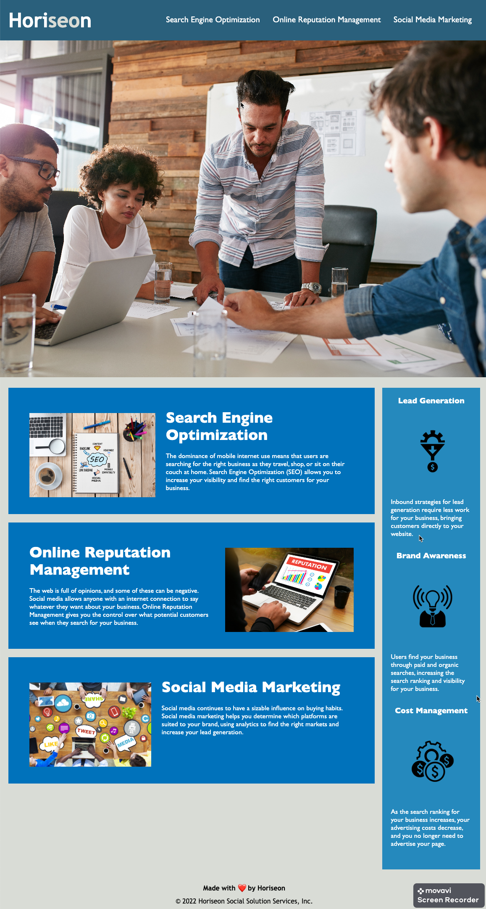

# Horiseon Refactor

## Description

> Module-1 challenge

Following scout rules, I wanted to refactor the existing code to meet Horiseon's standard — improving the accessibility features of their site. Web accessibility doesn't just help users who are differently-abled, but also, optimizes the page on search engines.

## Table of Contents:

- [Installation](#installation)
- [Usage](#usage)
- [Credits](#credits)
- [License](#license)

## Installation

Go to [webpage](https://salmaloum.github.io/Horiseon-refactor/) to navigate through Horiseon's services.

## Usage

Click on the navigation links or scroll through the page to learn more about Horiseon's services.

The following image demonstrates the web application's appearance

## Credits

- Horiseon Social Solution Services, Inc.
- [Salma Loum](https://github.com/SalmaLoum/)
- [UCLA Extension Bootcamp](https://www.uclaextension.edu/?gclid=Cj0KCQiAgribBhDkARIsAASA5btdbwAz8x25r3b1deoRNIGxfkPFL11rAQMuCgQ7HYiqBH8CLr9CgLoaAktlEALw_wcB&gclsrc=aw.ds)

## License

Please refer to the LICENSE in the repo.

---
